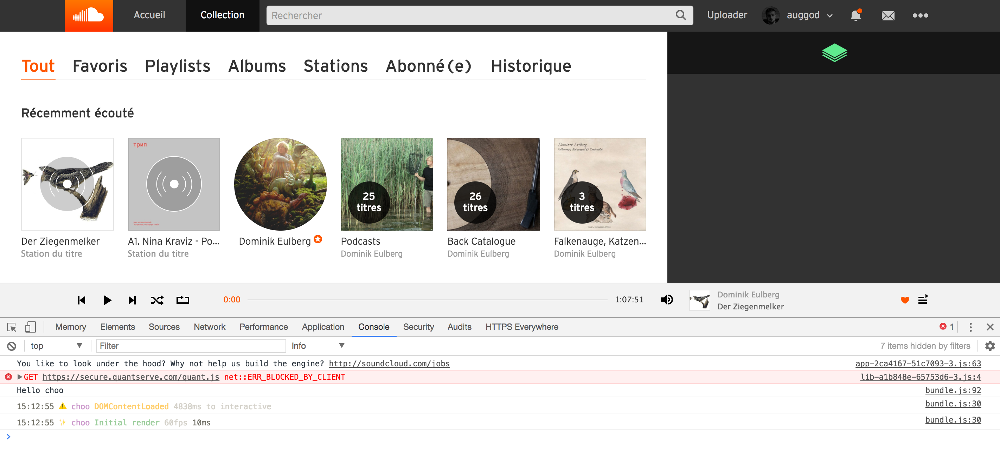

# Stack

This is a chrome extension

## Features (WIP)

  - Get user selection using browser context menu (stack)
  - Store selection within chrome.storage.local
  - Archive all selections
  - Resolve selection: Search soundcloud/spotify etc... to get infos about each items within selection (tracks) and store the results in a new object
    - This part could be done by web app calling an API after getting infos of selection
    - Could also just allow user to paste tracklist into a form too
  - From a web app, allow user to listen to tracks stored within chrome extension

## Stack (within soundcloud)

# License

MIT
